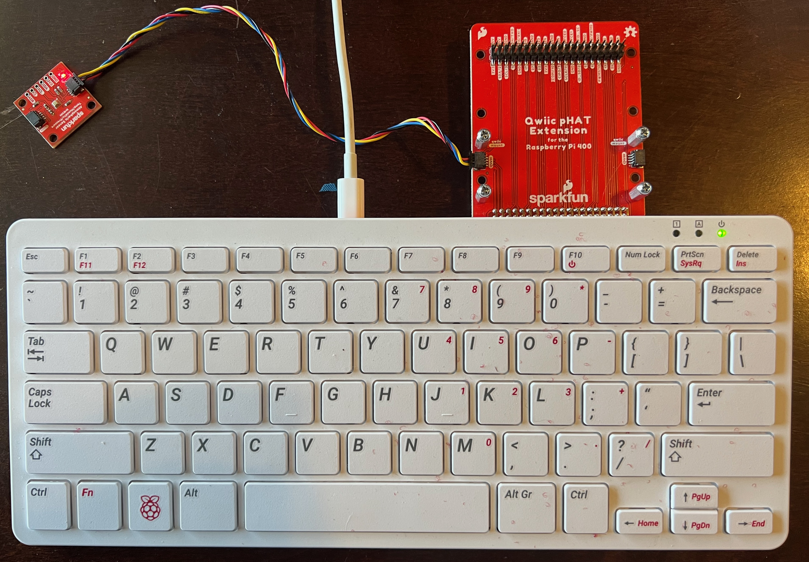
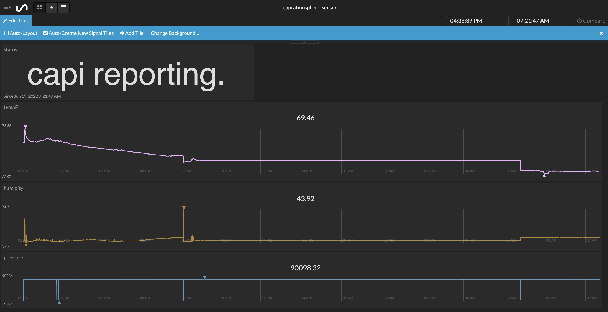

# Atmospheric sensing, posting data to an online dashboard

In this lesson we'll collect temperature, humidity, and air pressure data from
a sensor and post it to an online dashboard. You can also post data from your
VOC and PM sensors to the same dashboard - for a challenge after getting this
code to work, try sending other data to the dashboard.

## Parts list

For this exercise you'll need:
* [Raspberry Pi 400](https://www.sparkfun.com/products/17377) computer
* Sparkfun [Qwiic pHAT Extension](https://www.sparkfun.com/products/17512)
* Sparkfun [BME280 Atmospheric Sensor](https://www.sparkfun.com/products/15440)
* Sparkfun [Qwiic cable (500mm)](https://www.sparkfun.com/products/14429)
* [Initial State](https://www.initialstate.com/) access and bucket keys
* An internet connection

If you haven't used Initial State before, start with their [_Getting Started_ documentation](https://support.initialstate.com/hc/en-us/categories/360000428291-Using-Initial-State).

## Wire pHAT and sensor



## Write a Python 3 program

To use the following code, open a command terminal. Then enter the following command:

```
source ~/code/4cscc-ln/venv/bin/activate
```

If this works you should see `(venv)` on the far left of the text in
your terminal.

Then, enter the following command to start an ipython terminal:

```
ipython
```

Finally, copy paste the following code into the ipython terminal. This will collect data from your atmospheric sensor every 10 second and display on an online dashboard. It will run until you press "Control-c" (i.e., press the "control" and "c" keys at the same time).


```python
import qwiic_bme280
from time import sleep, time
import sys
import urllib.request
import urllib.parse
import socket
import math

hostname = socket.gethostname()

# The following values should be added from your Initial State account.
# See https://www.initialstate.com/
access_key = '' # EDIT: Add your Initial State API endpoint access key
bucket_key = ''  # EDIT: Add your Initial State API endpoint bucket key
inst_api_endpoint = "https://groker.init.st/api/events?accessKey=%s&bucketKey=%s" % (access_key, bucket_key)


def report_string_inst(name, value):
    name = urllib.parse.quote(name)
    value = urllib.parse.quote(value)
    urllib.request.urlopen(inst_api_endpoint + '&%s=%s' % (name, value))


def report_status(value,quiet=False):
    if not quiet:
        print(value)
    report_string_inst("status", value)


def report_tph_inst(sensor):
        t = sensor.temperature_fahrenheit
        p = sensor.pressure
        h = sensor.humidity
        print(t, p, h)

        urllib.request.urlopen(inst_api_endpoint +\
                               "&tempF=%1.2f" % t +\
                               "&pressure=%1.2f" % p +\
                               "&humidity=%1.2f" % h)


def warmup_sensor(sensor, reporting_frequency, warmup_time):
    if warmup_time < 1:
        return

    start_time = time()

    while True:
        current_time = time()
        runtime = current_time - start_time
        if runtime < warmup_time:
            remaining_warmup_time_s = warmup_time - runtime
            remaining_warmup_time_m = math.ceil(remaining_warmup_time_s / 60)
            if remaining_warmup_time_m == 1:
                unit = "minute"
            else:
                unit = "minutes"
            report_status("%s warming up (about %d %s left)." %
                            (hostname, remaining_warmup_time_m, unit))
            sleep(reporting_frequency)
        else:
            return


def run(reporting_frequency=10, warmup_time=60):
    print("\nAtomospheric sensor (BME280) on %s:\n" % hostname)
    sensor = qwiic_bme280.QwiicBme280()

    if not sensor.is_connected():
        print("BME280 device not detected. Is it connected?", \
            file=sys.stderr)
        return

    sensor.begin()
    report_status("%s online." % hostname)

    # The first reading from this sensor is noise, so collect and ignore
    # data.
    _ = sensor.temperature_fahrenheit
    _ = sensor.pressure
    _ = sensor.humidity

    warmup_sensor(sensor, reporting_frequency, warmup_time)

    try:
        while True:
            sleep(reporting_frequency)
            report_tph_inst(sensor)
            report_status("%s reporting." % hostname, quiet=True)
    except (KeyboardInterrupt, SystemExit):
        report_status("%s offline." % hostname)

run()
```

## Dashboard output


