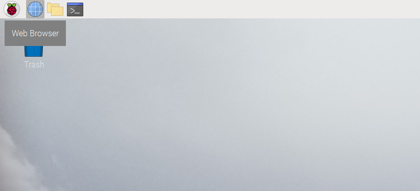
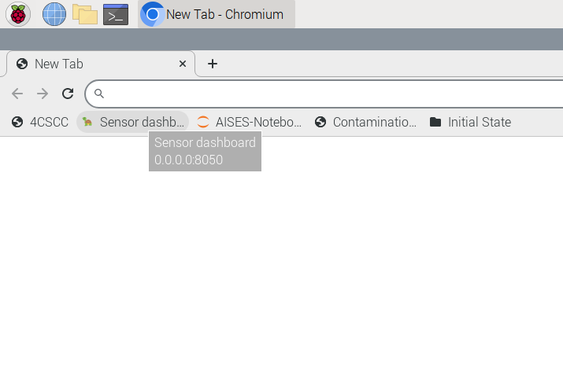
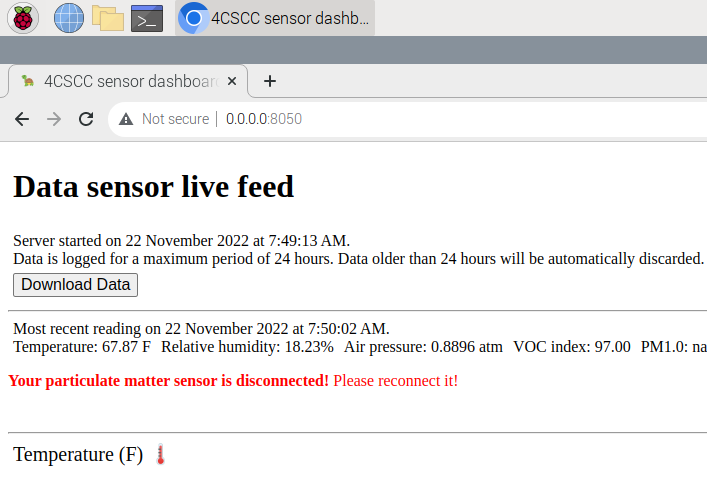

(dashboard-1)=
# Using the built-in sensor dashboard

Your Raspberry Pi disk image has a built-in sensor dashboard that you can access through the web brower.
To use this, you should have already assembled your Raspberry Pi and sensor kit, as illustrated in [](kit-assembly).

## Access the built-in dashboard

After powering on your computer, click the globe icon toward the top-left of your screen (to the right of Raspberry icon).
That will open a web browser.



The web browser should have a bookmark in the _Bookmark Bar_ for _Sensor Dashboard_.
Click that link to open the dashboard.



## Using the built-in dashboard



The built-in dashboard will start collecting data from the sensors you've connected to your computer when you open it.
Toward the top of the display, you'll see current readings for all of the sensors that are connected correctly to the computer.
If you see a note in read about your "tph" or "voc" sensors not being connected, power the computer off and review the instructions in [](kit-assembly) to see if you made a mistake.
If you haven't moved ahead in this book yet, you'll see a note about the "particulate matter" sensor not being connected.
That's ok for right now.
When you're ready to connect the particulate matter sensor, you can follow the steps in [](pm-1).

It will take about a minute for data to start showing up in the graphs.
Try to manipulate the data sensors you've connected to the machine to see how the graphs and the data change.
For example, place the temperature, pressure, and humidity sensor chip in your hand, and gently close your hand around it.
What values do you see change in the dashboard?

What are some things that you can do to change the readings of temperature?
How about humidity, air pressure, or VOC?
Experiment with different supplies in your home or classroom to test ideas about how you might be able to manipulate the environment around your data sensors.

```{warning}
Remember that while you can handle and experiment with the computer and attached hardware, this is delicate equipment. Don't do anything that will get the supplies wet or too warm. Temperature readings above 95° F may create conditions that could damage the computer.
```

## Posting to an online dashboard
If you'd like to be able to access the data generated on your computer from the Internet, you can build an online dashboard.
This will require some programming skills, but it's not too hard.
You can find instructions for this in [](online-dashboard).

## Getting started

Feel free to start reading the book and experimenting with the computer.
If some parts of the book are too basic for you, skip ahead to the more advanced sections.
In particular Chapters 4, 5 and 6 are good to read through and follow along with.
These will introduce you to programming and building digital circuits.