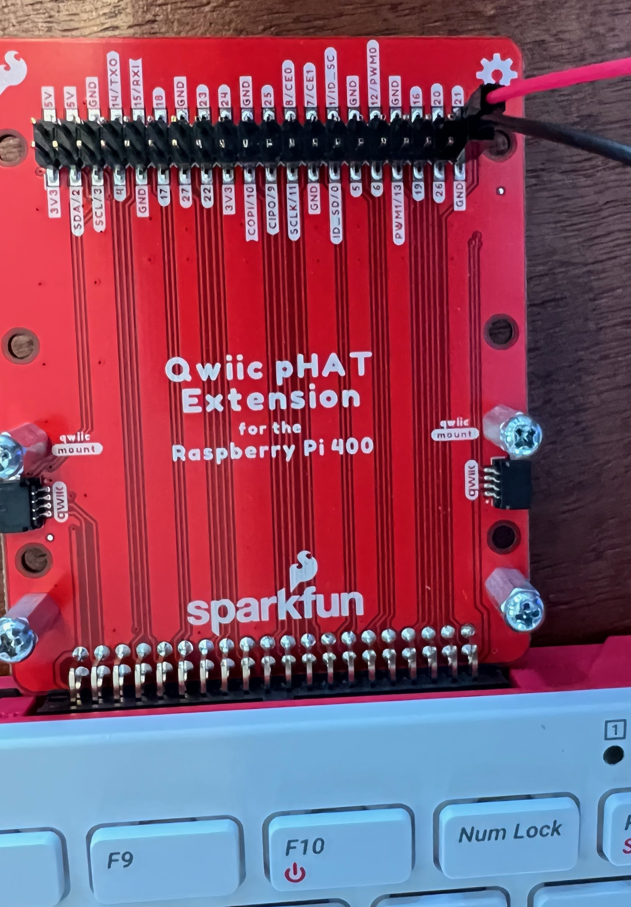
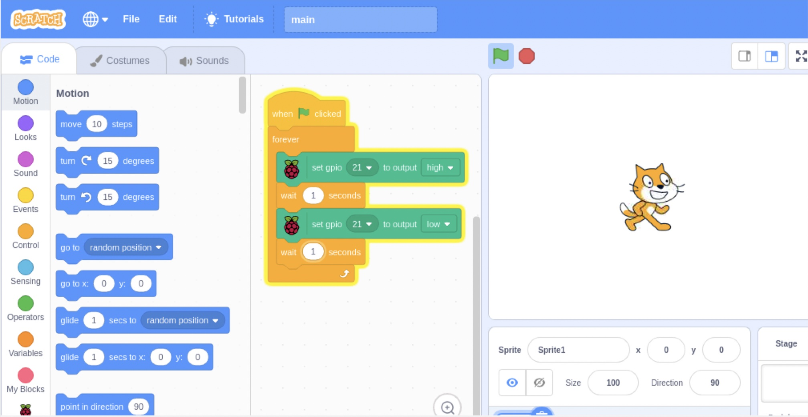

# Hello LED

In this lesson we'll complete our first physical computing experiments: we'll
connect an LED to our Raspberry Pi, and make it blink.

## Parts list

For this exercise you'll need:
* Raspberry Pi 400 computer
* Sparkfun Qwiic pHAT Extension
* One single-color LED
* Two male-to-female jumper wires (one red and one black if possible)
* One male-to-male jumper wire (black if possible)
* One 330 Ohm resistor

## Wire pHAT



## Wire breadboard


## Write a Scratch 3 program



## Write a Python 3 program

```python
from gpiozero import LED
from time import sleep

led = LED(21)

while True:
    led.on()
    sleep(1.0)
    led.off()
    sleep(1.0)
```