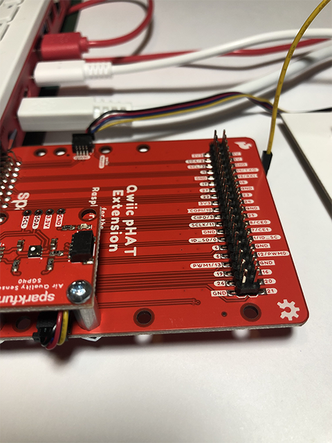
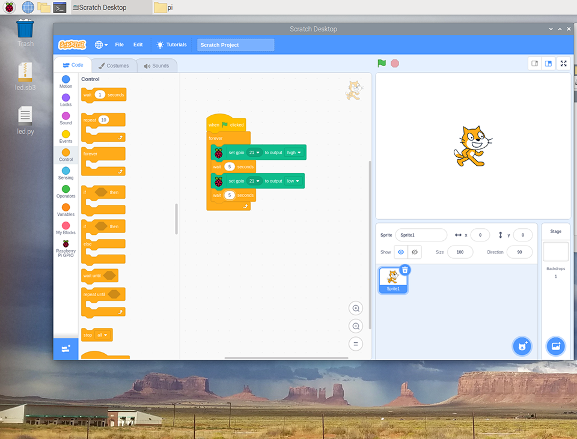

# Blinking an LED from Scratch and Python 3

In this lesson we’ll complete our first physical computing experiment: we’ll connect an LED to our Raspberry Pi, and make it blink.
    
## Getting started
For this exercise, you will need the following:
* Raspberry Pi 400 computer
* Sparkfun Qwiic pHAT Extension
* One single-color LED
* Two male-to-female (M-to-F) jumper wires (on M-to-F only one end has a metal pin)
* One male-to-male jumper wire (on M-to-M both ends have a metal pin)
* One 330 Ohm resistor

```{warning}
Start with your Raspberry Pi 400 computer turned off
```

---

## Assembling the pHAT

We need to make connections from the Raspberry Pi 400 GPIO (general-purpose input-output) pins. While we could connect to the Raspberry Pi pins directly, using the Qwiic PHAT Extension makes this more convenient as the pins are labeled and more accessible. There are 40 male (metal) pins available to use for powering devices or communicating with hardware (i.e., collecting input from them or providing output to them).

    

## Wire to the Breadboard

A breadboard lets you insert (plug) components and have them connect through metal tracks hidden beneath the surface. This makes it MUCH easier to build circuits.

1. Collect one M-to-F pin. Take the female end and attach it into the GND (ground) on the pHAT male pin.
2. Collect another M-to-F pin. Attach the female end (yellow) to 21 on the pHAT male pin.
3. Take the male end of the M-to-F pin connected to GND and insert it into column (-) in row 1 of the breadboard.
4. Take the male end of the other M-to-F pin connected to 21 and insert it into the column (a) in row 4 of the breadboard.

    

5. Collect the M-to-M pin. Take one end and insert it into column (-) in row 30 of the breadboard.

    

6. Take the other end of the M-to-M pin and insert it into column (j) in row 5 of the breadboard.

    

## Adding the 330 ohm resistor

A resistor are components that control the flow of electrical current. Each resistor has different values measured using ohms. the higher the number of ohms, the more resistance is provided. Resistors are used to protect different components (like an light emitting diode) from drawing too much current which can result in damaging components or even the Raspberry Pi 400.

1. Pick up the resistor and look at the color combination. It reads orange, red, brown gold. To read the resistor color codes, you can watch the video ["How to Read a Resistor"](https://www.youtube.com/watch?v=GLD7AgAYqwAv).

   
2. Take the brown end of the resistor and insert it into column (e) in row 4 of the breadboard.

3. Take the orange end of the resistor and insert it into column (f) in row 4.
    

## Adding the LED

A LED is a light emitting diode. It two legs, one is longer than the other. The longer leg is the anode, positively charged.

1. Take the longer leg of the LED and insert it into column (g) in row 4.

2. Take the shorter leg of the LED and insert it into column (g) in row 5.
    

## Power the system

1. Your connection of the electronics is all set-up.

    

2. Turn on the Raspberry Pi 400. The pHAT and power will light up red.

    


## Write a Scratch 3 program
For this part of the exercise, you will be using the [Scratch](https://scratch.mit.edu/) programming language.

1. Go to the Raspberry icon, click on Programming and select Scratch 3. This will pop-up a new window that will go through two messages "Scratch Desktop is loading" and "Creating Project".

    

1. The Scratch 3 program will open up to the home screen.

    

    * The far left panel (A) is called the Blocks Palette. These are the available blocks for your program.
    * The next panel (B) is called the Blocks. The blocks are pre-written chunks of program code that allow you to build your program.
    * The center panel (C) is called the Code Area. This is the space where your program is build by dragging and dropping blocks from the Blocks Palette to form scripts.
    * The two icons (D) are the green flag and red stop sign. The green flag icon will run the program. The red stop sign icon will stop the program.
    * The button (E) is the Add Extension icon. This loads blocks that are part of extension features.

1. To access the blocks associated with the pHAT, we need to add the GPIO blocks. Go the blue Add Extension icon on the lower left corner.

    

1. Scroll down and select the Raspberry Pi GPIO. This will yield blocks to control the Raspberry Pi GPIO lines.

    

1. If done successfully, the new icon Raspberry Pi GPIO will appear in the Blocks Palette panel.

    

Now let's turn on the LED! Scratch is a drag-and-drop approach to writing code. The blocks have different shapes that allow them to be built in a modular connection.

1. The first block to add is the `when clicked`. Click on the circle "Events" and find when clicked. Drag it over into the Code Area panel.

    

    

1. Next, click on the Raspberry Pi GPIO icon. Select the `set gpio 0 to output high` block and drag it over into the Code Area panel.

    

1. You'll need to choose the number of the pin you're using. Look at the GPIO m-to-f jumper wire, it is plugged into '21'. Click on the small arrow to open the drop-down selection and click on 21, this is the GPIO 21 pin.

    

1. Next, click on the click on the green flag icon to run the program. You should see the LED light up!

    

1. To turn off the LED, click on the down arrow at the end of the block and choose 'low' from the list.

    

1. To flash the LED on and off every second, we have to use the `forever` block and two 'wait 1 second' blocks. Click on the circle "Control" to get the blocks.

    

1. Build the program as you see below. Then click on the green flag icon to run your program!

    

Congrats on using Scratch 3 to program your blinking LED!

## Write a Python 3 program

For this part of the exercise, you will be using the [Thonny Python IDE](https://thonny.org/). IDE stands for "Integrated Development Environment" and is intended to provide everything you need to develop software.

1. Go to the Raspberry icon, click on Programming and select Thonny Python IDE. This will pop-up a new window. The top panel (labeled `<untitled>`) is the code editor. The bottom panel (labeled `shell`) is where you can execute (or run) your script.

    

1. Copy the code below and paste into the untitled code editor.

    ```python
    from gpiozero import LED
    from time import sleep

    led = LED(21)

    while True:
        led.on()
        sleep(1.0)
        led.off()
        sleep(1.0)
    ```
    

    `gpiozero` is called a library, and this library provides an object called `LED`, which helps you work with LEDs from within Python. The variable `led` lets the library know which GPIO pin (21) the LED is connected to.

1. Save the program with the name "blinking-led". This will switch the file to a .py or .python file ending. Then click on "Run" to run the code.

    

----
## Reflection

* Look at the code above and adjust the values in `sleep(1.0)` of the Python program or `wait X second` in Scratch. How could you speed up or slow down the LED?
* In the Python code, what is the smallest amount of time that you can have the code sleep for while still being able to see the LED flashing?
