# Multi-color LED
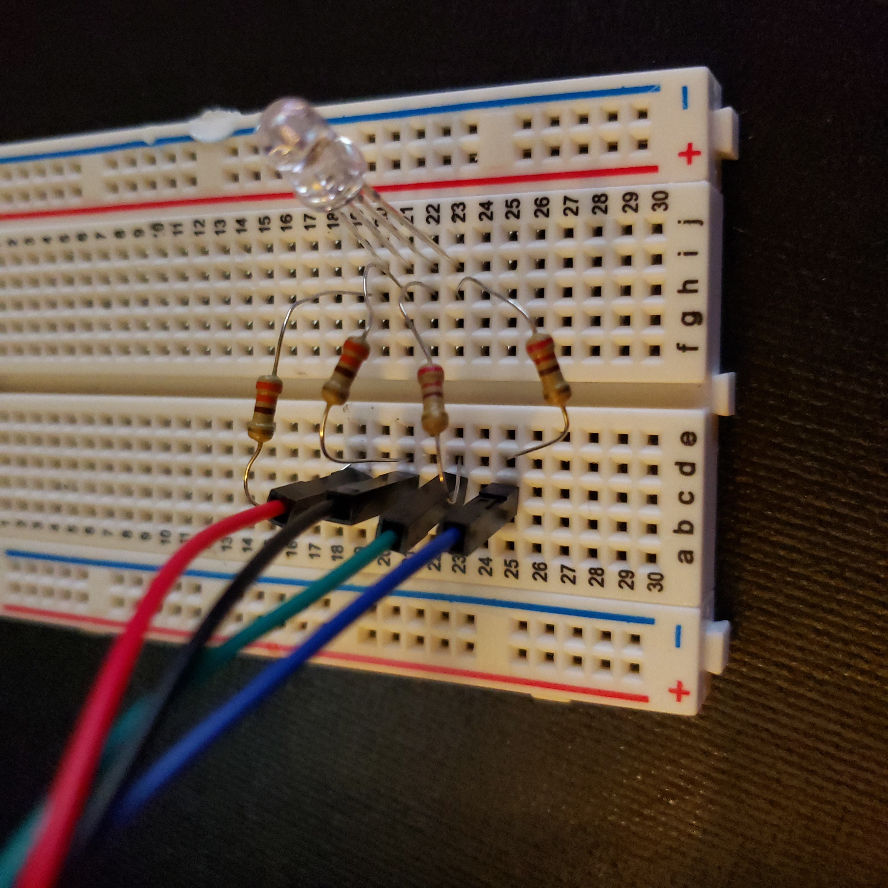

## Getting started
For this exercise, you will need the following:
* Raspberry Pi 400 computer
* Sparkfun Qwiic pHAT Extension
* One multi-color LED
* Four M-to-F Jumper Wire (1 Black, 1 Red, 1 Green, 1 Blue)
* Four 330 Ohm resistor

## Connecting the LED

1. With the pHAT already connected (See Blinking LED Lesson above):
    * View the multi-colored LED, the longest pin is the anode.
[LED LESSON ON LED CATHODE/ANODE](https://www.admfactory.com/rgb-led-on-raspberry-pi-using-python/)
    * The other pins represent RGB, respectively, so we read the pin as follows:
Red, Anode, Green, Blue.
We will have the jumper wires complement each pin color for easier coordination, we will also line up these pins on the GPIO pins.

2. Install RGB-LED.
    * Insert anode vertically into the Column I, Row 21.

    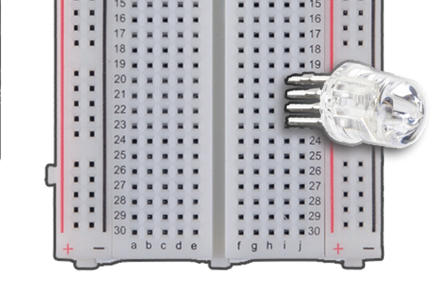

3. Gather your resistors to allow a steady current for our LED.
    * Insert either end of the resistor into the Column H, Row 20.
    * Bridge the gap of the breadboard with the resistor, and insert the other end into Column D, Row 19.
    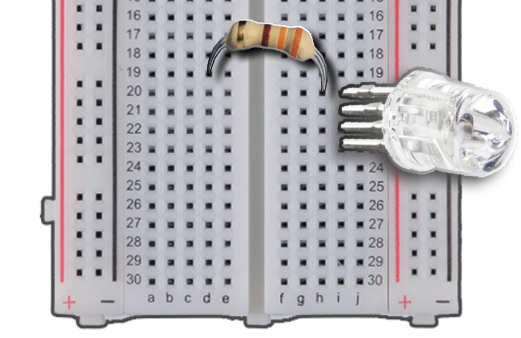
    * We will continue adding resistors for the anode, green, and blue pins.
        * For the anode, insert either end of the resistor into Column H, Row 21, and the other end into Column D, Row 21.
          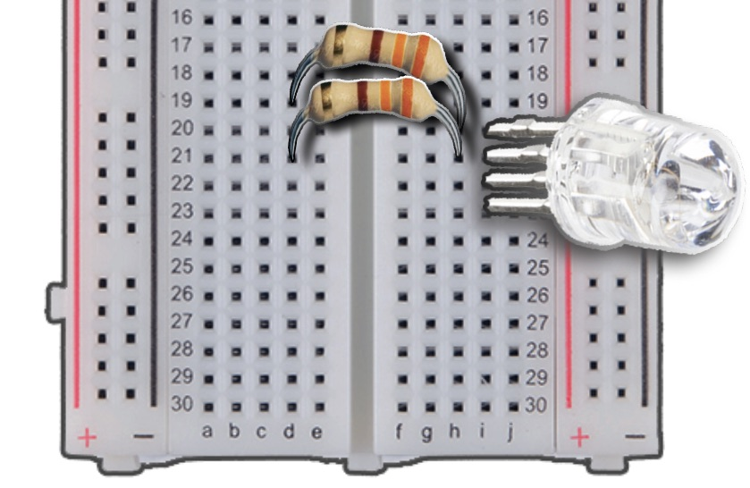
        * For the BLUE pin, insert either end of the resistor into Column H, Row 23, and the other end into Column D, Row 25.
          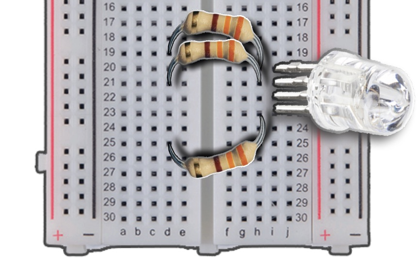
        * Finally, for the GREEN pin, insert either end of the resistor into Column H, Row 22, and the other end into Column D, Row 23.
          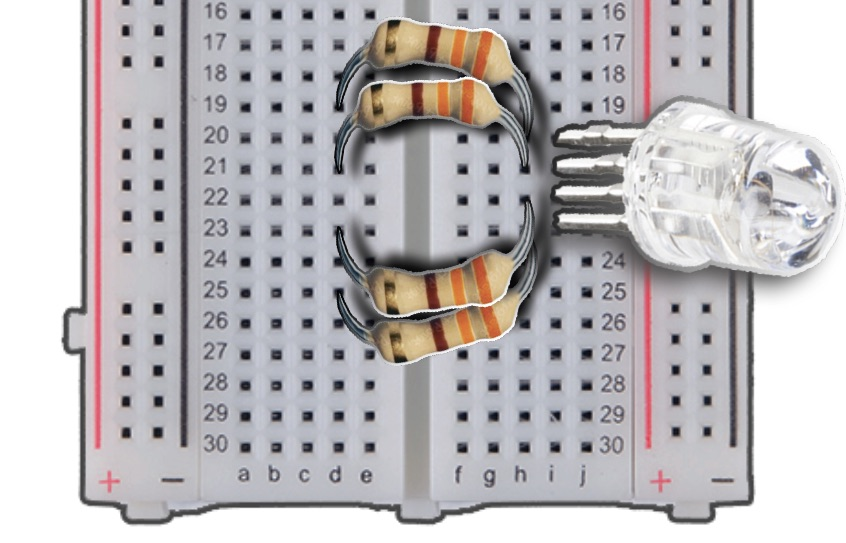

4. Collect your M-to-F Jumper Wires.
    * This step will connect the wires to resistors, so the 3V does not wear out the LED.
        * With your RED M-to-F Jumper Cable, attach the Male end into  Column C, Row 19 of the breadboard. then attach the Female end to Pin 17 of the pHAT.
        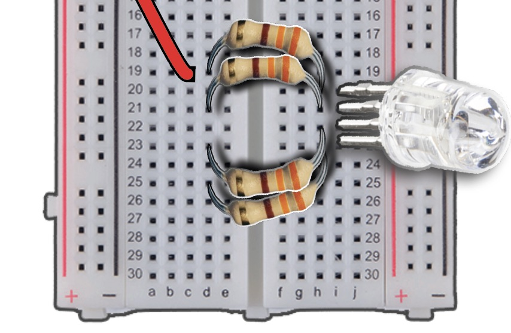
        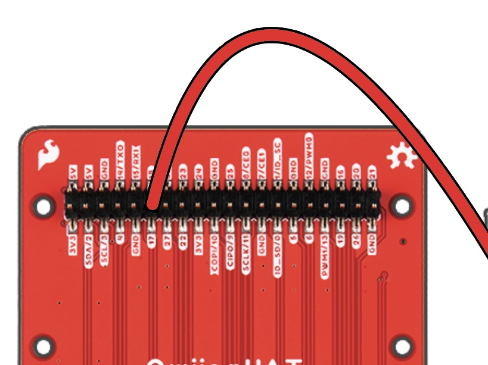
    * We will continue adding M-to-F Jumper Wires for the Anode, Green, and Blue pins.
        * Insert Male pin of Black wire into Column C, Row 21, attaching the opposite end to 3V3 of the pHAT.
         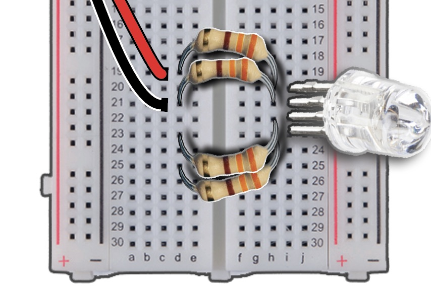
         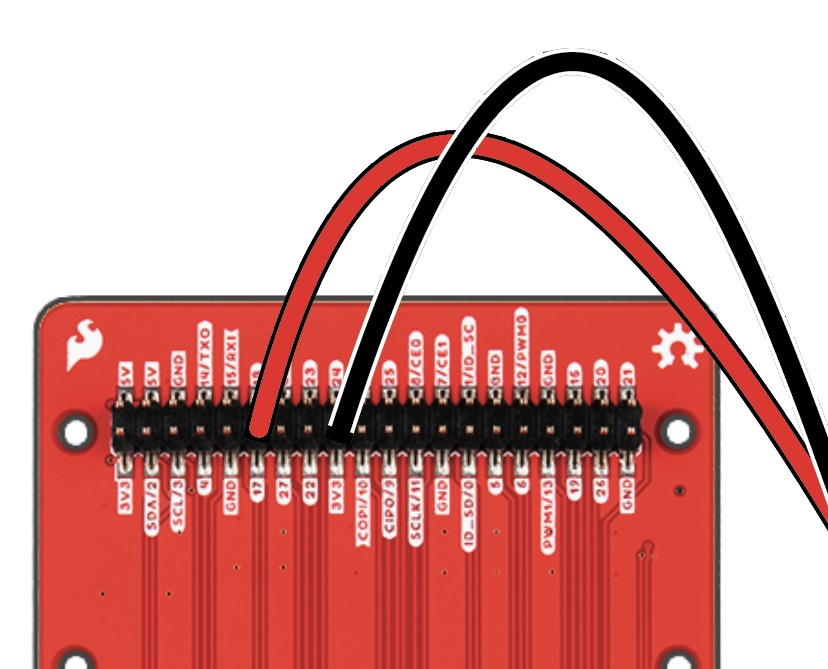
        * Insert Male pin of GREEN wire into Column C, Row 23, attaching the opposite end to Pin 27 of the pHAT.
         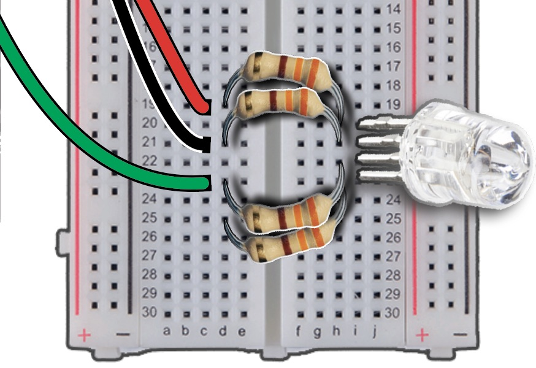
         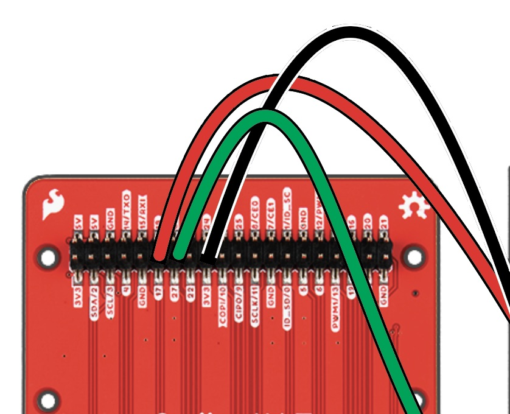
        * Insert Male pin of BLUE wire into Column C, Row 25, the opposite end will be attached to Pin 22 of the pHAT.
         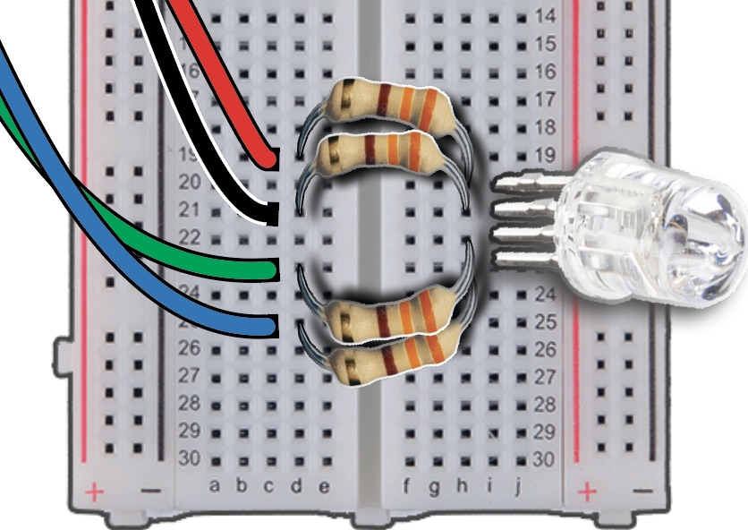
         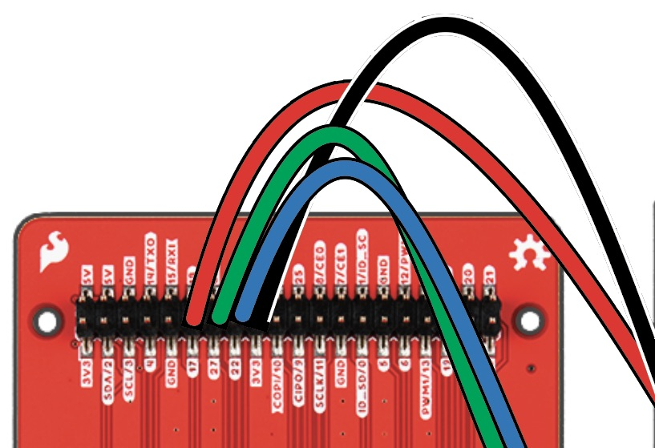

## Final Wiring Diagram
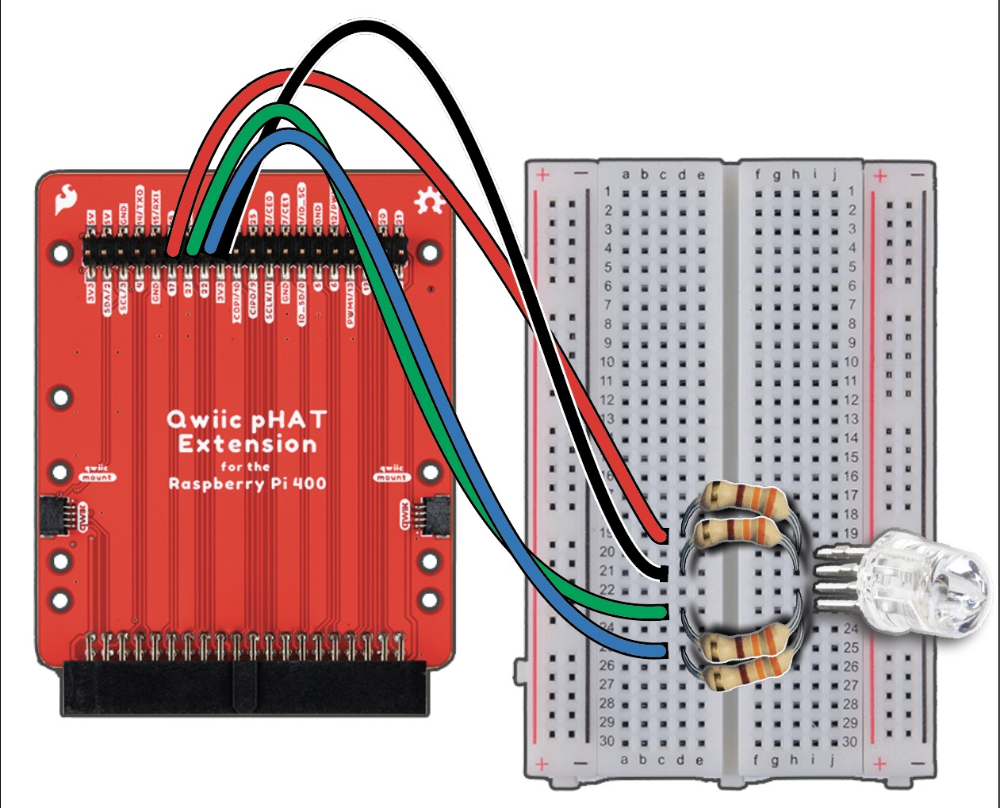

## Write a Python 3 program

Follow the instructions in the previous lesson, open the Thonny Python IDE, and copy and paste the following code into it.

    ```
    python
    #libraries
    import RPi.GPIO as GPIO
    from time import sleep
    #disable warnings (optional)
    GPIO.setwarnings(False)
    #Select GPIO Mode
    GPIO.setmode(GPIO.BCM)
    #set red,green and blue pins
    redPin = 17
    greenPin = 27
    bluePin = 22
    #set pins as outputs
    GPIO.setup(redPin,GPIO.OUT)
    GPIO.setup(greenPin,GPIO.OUT)
    GPIO.setup(bluePin,GPIO.OUT)

    def turnOff():
        GPIO.output(redPin,GPIO.HIGH)
        GPIO.output(greenPin,GPIO.HIGH)
        GPIO.output(bluePin,GPIO.HIGH)

    def white():
        GPIO.output(redPin,GPIO.LOW)
        GPIO.output(greenPin,GPIO.LOW)
        GPIO.output(bluePin,GPIO.LOW)

    def red():
        GPIO.output(redPin,GPIO.LOW)
        GPIO.output(greenPin,GPIO.HIGH)
        GPIO.output(bluePin,GPIO.HIGH)

    def green():
        GPIO.output(redPin,GPIO.HIGH)
        GPIO.output(greenPin,GPIO.LOW)
        GPIO.output(bluePin,GPIO.HIGH)

    def blue():
        GPIO.output(redPin,GPIO.HIGH)
        GPIO.output(greenPin,GPIO.HIGH)
        GPIO.output(bluePin,GPIO.LOW)

    def yellow():
        GPIO.output(redPin,GPIO.LOW)
        GPIO.output(greenPin,GPIO.LOW)
        GPIO.output(bluePin,GPIO.HIGH)

    def purple():
        GPIO.output(redPin,GPIO.LOW)
        GPIO.output(greenPin,GPIO.HIGH)
        GPIO.output(bluePin,GPIO.LOW)

    def lightBlue():
        GPIO.output(redPin,GPIO.HIGH)
        GPIO.output(greenPin,GPIO.LOW)
        GPIO.output(bluePin,GPIO.LOW)

    while True:
        turnOff()
        sleep(1) #1second
        white()
        sleep(1)
        red()
        sleep(1)
        green()
        sleep(1)
        blue()
        sleep(1)
    ```

The following are examples of the LED lighting up yellow, purple, and light blue using the
provided code.

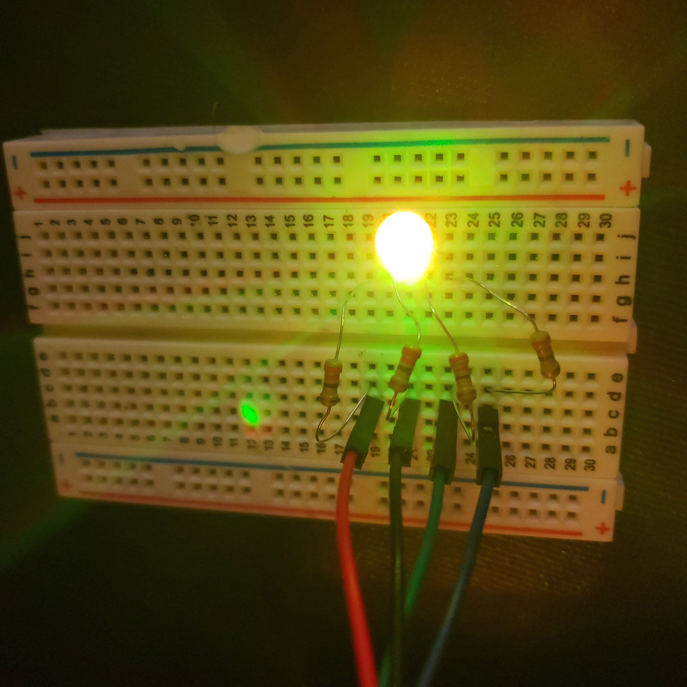

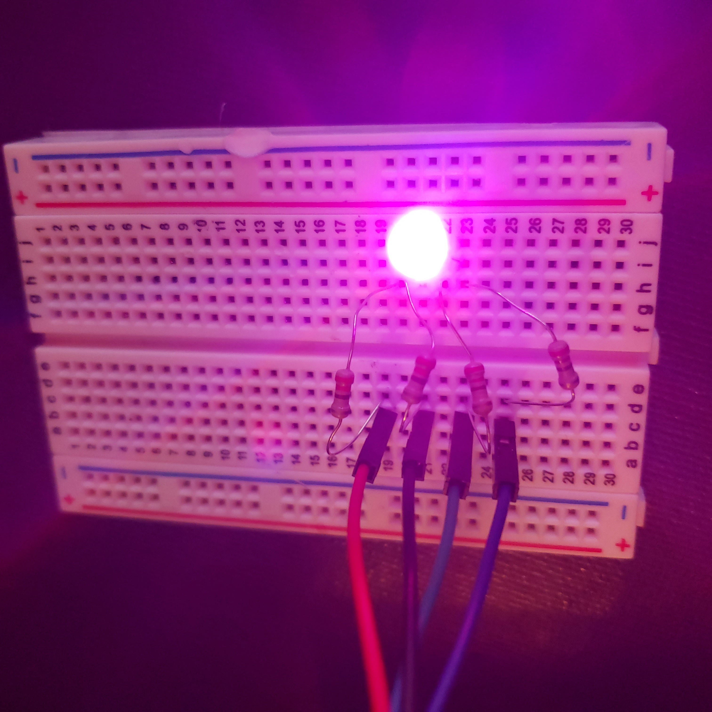

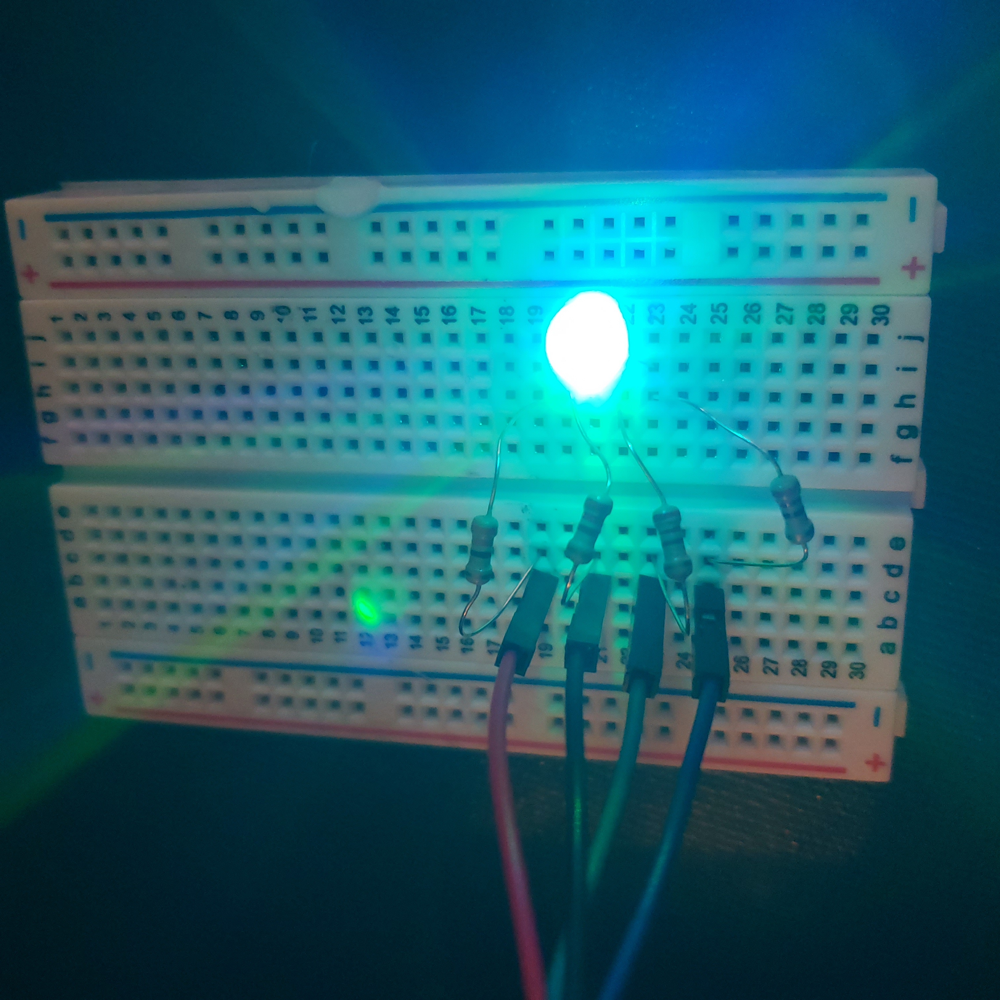
