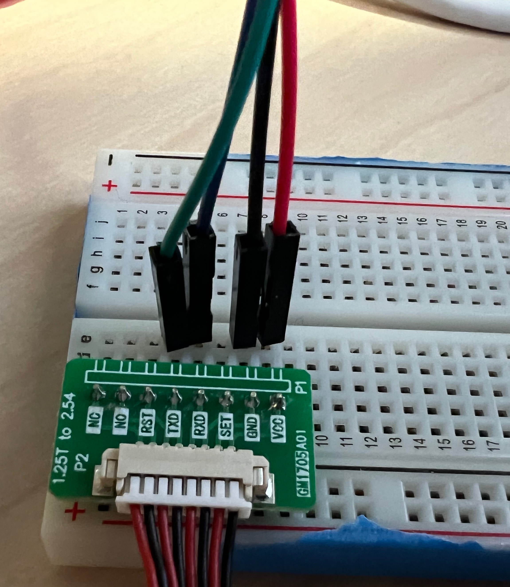
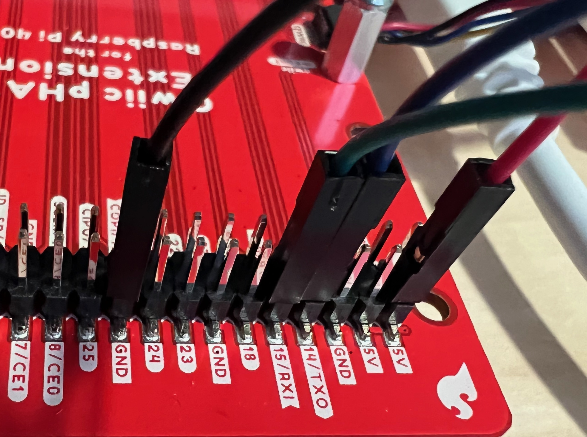

# Particulate matter sensing to assess indoor air quality

In this lesson...

## Parts list

For this exercise you'll need:
* [Raspberry Pi 400](https://www.sparkfun.com/products/17377) computer
* Sparkfun [Qwiic pHAT Extension](https://www.sparkfun.com/products/17512)
* PMS5003
* Breadboard
* 4 male to female jumper wires

## Assembly

You should have a pm sensor with the cable already attached as shown. On the
other end of the cable there should be a green board with 8 pins.

&nbsp;

You should insert the 8 pins along a column on the breadboard as shown below.
Then use the male ends of the 4 male to female jumper wires on the same rows of
the breadboard as the pins labeled TXD, RXD, GND, and VCC.

&nbsp;

Connect the female end of the GND wire to GND on the Qwiic. Connect the female
end of the VCC wire to 5V on the Qwiic. Connect the female end of the TXD wire
to 14/TXO on the Qwiic. Connect the female end of the RXD wire to 15/RXI on the
Qwiic.

&nbsp;

You should now have a complete product that looks like the following with the
pm sensor wired to the breadboard and the breadboard wired to the Qwiic.


## Python 3 code

Before running the following code make sure you are in the proper virtual
environment by running `source ~/code/4cscc-ln/venv/bin/activate` in your
terminal. If this works you should see `(venv)` on the far left of the text in
your terminal. This code was adapted from the files found
[here](https://github.com/pimoroni/pms5003-python/tree/master/examples). This
repo contains the source for the pms5003 module we use to read from the sensor.

```python
# Import the library we use to access the sensor
from pms5003 import PMS5003
# We are going to wait between sensor readings so we don't spam too many
from time import sleep


# Create an object representing our sensor
pms5003 = PMS5003()

# Repeat this as long as the program is running
while True:
    # Read the data from the sensor
    pms_reading = pms5003.read()

    # Print all of the data from the sensor
    print(pms_reading)

    # Access and print the specific pieces of data we are looking at in the
    # dashboard
    print(pms_reading.pm_ug_per_m3(1.0))
    print(pms_reading.pm_ug_per_m3(2.5))
    print(pms_reading.pm_ug_per_m3(10))

    # Wait for one second before attempting to read from the sensor again
    sleep(1)

```