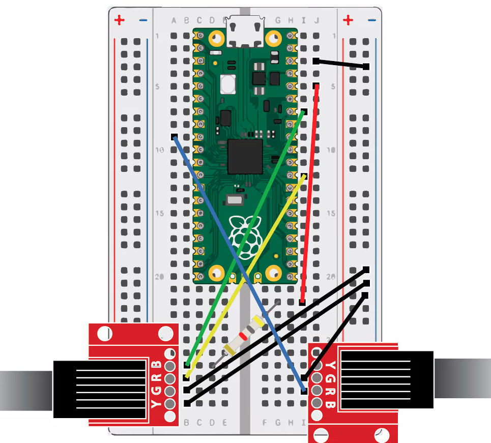
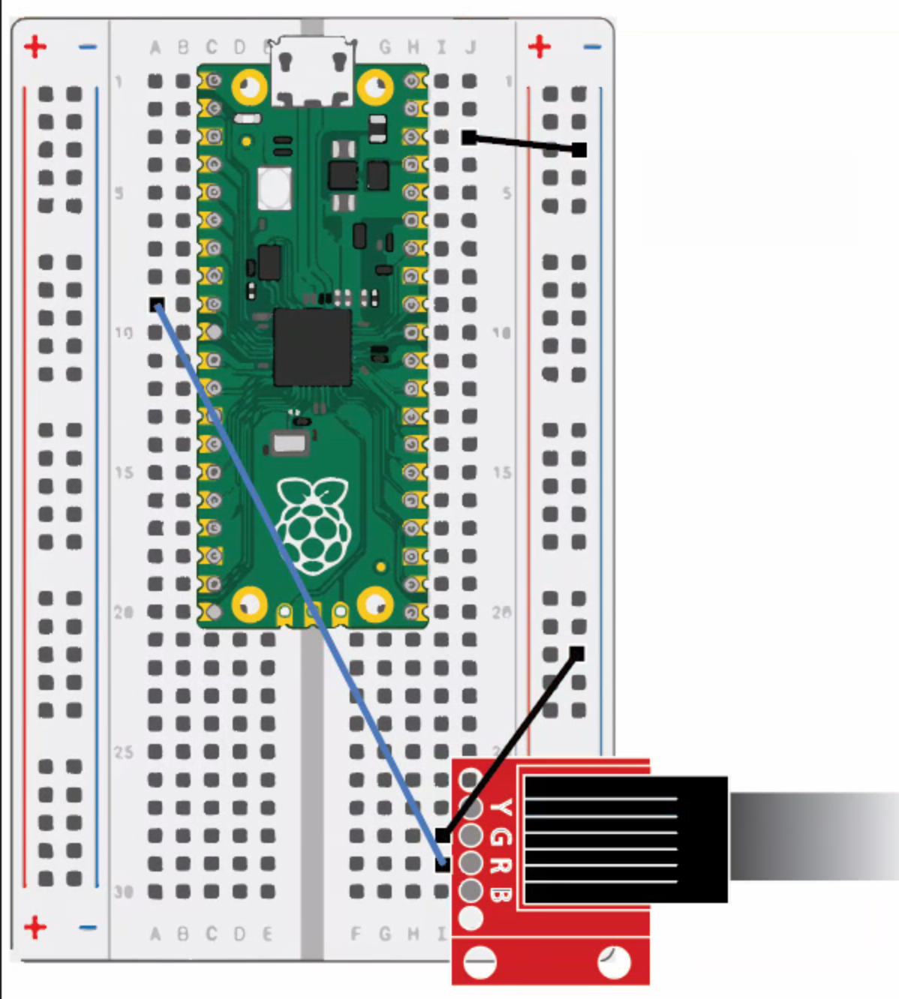
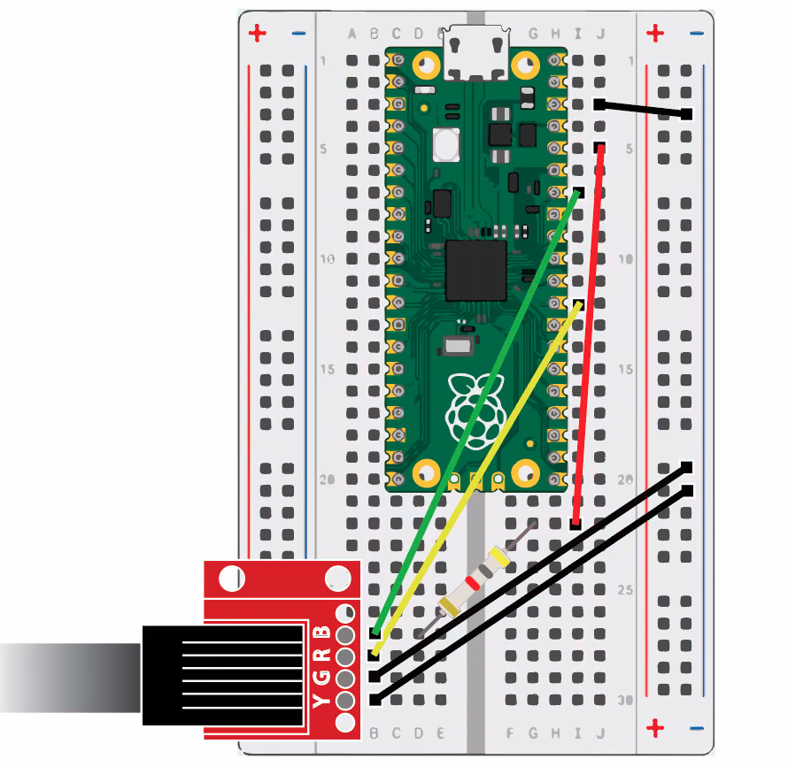

# Weather Sensor

## Introduction
For this next exercise we will use a Raspberry Pi Pico W,
MicroPython, and the Thonny IDE to gather analog readings
from an anenometer, a wind vane, and a rainfall bucket.  This exercise requires
the following materials:
* One Raspberry Pi Pico W, with micro-USB cable and small breadboard
* One [Sparkfun Weather Meter Kit](https://www.sparkfun.com/products/15901)
* Eight M-to-M jumper wires
* One 4.7 kOhm resistor
* Two RJ-11 connectors soldered to a breakoutboard

## Materials and Resources
Documentation for getting started with your Pico can be found [here](https://www.raspberrypi.com/documentation/microcontrollers/raspberry-pi-pico.html#raspberry-pi-pico-w).
We will also download and install MicroPython, [click here](https://www.raspberrypi.com/documentation/microcontrollers/raspberry-pi-pico.html)
for further instructions.  

Once MicroPython is setup on your Raspberry Pi, open your Thonny IDE.  
We will configure Thonny's Interpreter to ensure MicroPython is properly installed.
* Click near the bottom-right corner of the Thonny window.
* Select Configure Interpreter..., then navigate to the Interpreter tab if needed, 
* Next, click the drop-down menu and select MicroPython (Raspberry Pi Pico).
* Click OK to close the window.

Gathering analog readings from our anemometer and rainfall bucket is a neat feature the Pico W enables.
These readings are acquired from reed switches, magnetic signals are sent through the cables.
Converting analog-to-digital (ADC) is a built-in feature, which requires less materials for our exercise.

## Connecting Hardware
* Collect and firmly attach your Raspberry Pi Pico W to your small breadboard.
* Attach RJ-11 connectors to breadboard, alignng the pins horizontally, starting on Column A, Row 27 to 30. 
* Attach the second RJ-11 connector to the opposing side, Column J Row 27-30.
* For this exercise, we will connect both cables and run their respective scripts separately.
* Connect the cable with 4 pins to the left connector.
* Connect the  cable with pins to the right connector.

## Wiring Diagram
View the following diagram of the rainfall and wind cables connected, notice where the resistor is used.
    
    

# Scripts for Weather Meter
## Rainfall
1. First, we will test the rainfall readings produced by the bucket tips.
View the wiring diagram for the rainfall sensor (below).
    * Follow this wiring diagram to help assist thorough execution.
    
2. Open a new file, copy and paste the following script, then save and run the program.
    * Make sure your Thonny Intepreter is set to MicroPython.

```
from machine import Pin
import utime

rain_sensor = Pin(6, Pin.IN, Pin.PULL_UP)
BUCKET_SIZE = 0.2794
count = 0
previous_value = 1

def bucket_tipped():
    global count
    count = count + 1
    f = open('data.txt', 'a')
    f.write(str(count * BUCKET_SIZE) + '\n')
    f.close()
    print (count * BUCKET_SIZE)
    
def reset_rainfall ():
    global count
    count = 0

while True:    
    value = rain_sensor.value()
    
    if value and not previous_value:
        bucket_tipped()
        
    previous_value = value
```


    
## Wind Meter - Direction and Speed
We will use the following wiring diagram and scripts to display wind speed and wind direction.  
    * View the following wiring diagram to help you execute the program:
    
### Wind Speed:

   Copy and paste into your Thonny IDE, run the script and wait five seconds for readings.
    
```
from machine import Pin
import utime
import math

wind_count = 0
radius_cm = 9.0
wind_interval = 5
CM_IN_A_KM = 10000.0
SECS_IN_AN_HOUR = 3600
ADJUSTMENT = 1.18
value = 0
previous_value = 1

def spin(pin):
    global wind_count
    wind_count = wind_count + 1
    #print("spin" + str(wind_count))

def calculate_speed(time_sec):
    global wind_count
    circumference_cm = (2 * math.pi) * radius_cm
    rotations = wind_count / 2.0
    
    dist_km = (circumference_cm * rotations) / CM_IN_A_KM
    
    km_per_sec = dist_km / time_sec
    km_per_hour = km_per_sec * SECS_IN_AN_HOUR
    return km_per_hour * ADJUSTMENT

wind_speed_sensor = Pin(6, Pin.IN, Pin.PULL_UP)
wind_speed_sensor.irq(handler=spin)

while True:
    wind_count = 0
    utime.sleep(wind_interval)
    print(calculate_speed(wind_interval), "cm/h", wind_count)
```


### Wind Direction

Copy and paste into your Thonny IDE, run the script and wait five seconds to get readings.
```
from machine import ADC, Pin
import utime

REFERENCE_VOLTAGE = 3.3

adc = ADC(28)
MAX = 2 ** 16 - 1
smps = Pin(23, Pin.OUT)
smps.value(1)


# These voltages are for a 3.3v power supply and
# a 4.7kOhm r1
volts = {2.9: 0.0,                                                                                                                                                                                                                                                                                                                                                                                                                                                                                                                                                                                                                                                                                                                                                                                                                                                                                                                                                                                          
         1.9: 22.5,
         2.1: 45.0,
         .5: 67.5,
         .6: 90.0,
         .4: 112.5,
         1.1: 135.0,
         .8: 157.5,
         1.5: 180.0,
         1.3: 202.5,
         2.6: 225.0,
         2.5: 247.5,
         3.2: 270.0,
         3.0: 292.5,
         3.1: 315.0,
         2.7 : 337.5}


while True:
    adc_val = adc.read_u16() / MAX
    wind = round(adc_val * 3.3, 1)
    try:
        print(str(volts[wind]))
    except KeyError:
        print(wind)
    utime.sleep(.2)    
```

## All Sensors for Weather Meter
Now that we have both cables inserted and running separately, let's run a single script for ALL sensors!

```
from machine import ADC, Pin
import utime
import math

# In seconds
interval = 5

# Rain globals
RAIN_PIN = 6
BUCKET_SIZE = 0.2794
rain_count = 0
rain_previous_value = 1

# Wind speed globals
WIND_PIN = 22
wind_count = 0
radius_cm = 9.0
CM_IN_A_KM = 10000.0
MI_IN_A_KM = 0.621371
SECS_IN_AN_HOUR = 3600
ADJUSTMENT = 1.18

# Wind direction globals
ADC_PIN = 28
adc = ADC(ADC_PIN)
MAX = 2 ** 16 - 1
# Setting this high makes the readings on
# the adc more consistent by forcing 3.3v
# on the power supply
smps = Pin(23, Pin.OUT)
smps.value(1)

# These voltages are for a 3.3v power supply and
# a 4.7kOhm r1
volts = {2.9: 0.0,                                                                                                                                                                                                                                                                                                                                                                                                                                                                                                                                                                                                                                                                                                                                                                                                                                                                                                                                                                                          
         1.9: 22.5,
         2.1: 45.0,
         .5: 67.5,
         .6: 90.0,
         .4: 112.5,
         1.1: 135.0,
         .8: 157.5,
         1.5: 180.0,
         1.3: 202.5,
         2.6: 225.0,
         2.5: 247.5,
         3.2: 270.0,
         3.0: 292.5,
         3.1: 315.0,
         2.7 : 337.5}


def bucket_tipped(pin):
    global rain_count
    global rain_previous_value
    value = rain_sensor.value()
    
    if value and not rain_previous_value:
        rain_count = rain_count + 1

    rain_previous_value = value


def reset_rainfall ():
    global rain_count
    rain_count = 0


def spin(pin):
    global wind_count
    wind_count = wind_count + 1
    #print("spin" + str(wind_count))


def calculate_speed(time_sec):
    global wind_count
    circumference_cm = (2 * math.pi) * radius_cm
    rotations = wind_count / 2.0
    
    dist_km = (circumference_cm * rotations) / CM_IN_A_KM
    
    km_per_sec = dist_km / time_sec
    km_per_hour = km_per_sec * SECS_IN_AN_HOUR
    mi_per_hour = km_per_hour * MI_IN_A_KM
    return km_per_hour * ADJUSTMENT


rain_sensor = Pin(RAIN_PIN, Pin.IN, Pin.PULL_UP)
rain_sensor.irq(handler=bucket_tipped)

wind_speed_sensor = Pin(WIND_PIN, Pin.IN, Pin.PULL_UP)
wind_speed_sensor.irq(handler=spin)


while True:
    rain_count = 0
    wind_count = 0
    
    utime.sleep(interval)
    print(calculate_speed(interval), "cm/h", wind_count, "ticks.")
    print(rain_count * BUCKET_SIZE, "mm of rain", rain_count, "tips.")

    adc_val = adc.read_u16() / MAX
    wind_dir = round(adc_val * 3.3, 1)

    try:
        print(str(volts[wind_dir]), "degree heading.")
    except KeyError:
        print(wind, "volts, unknown heading.")
    print()
```

